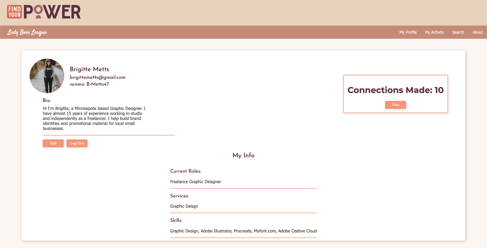
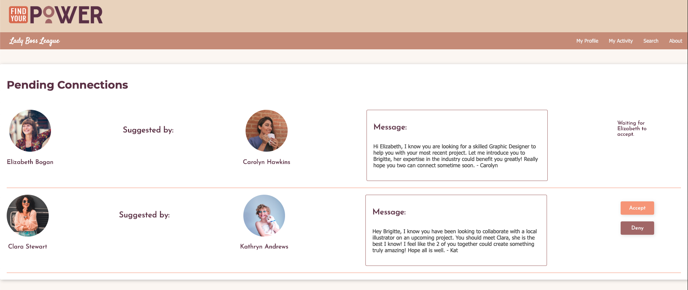
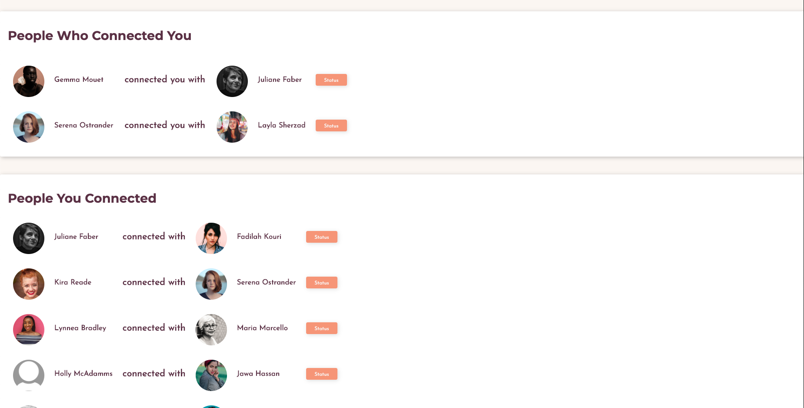
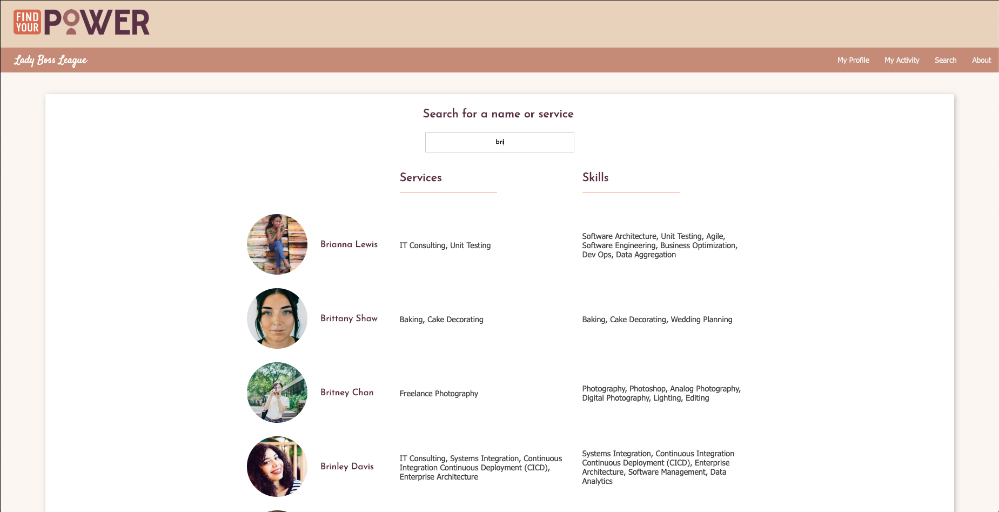
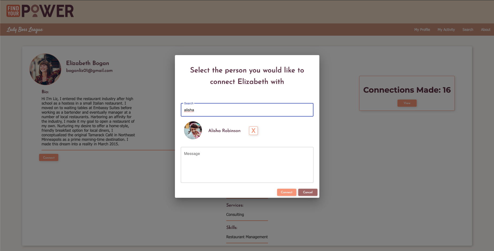
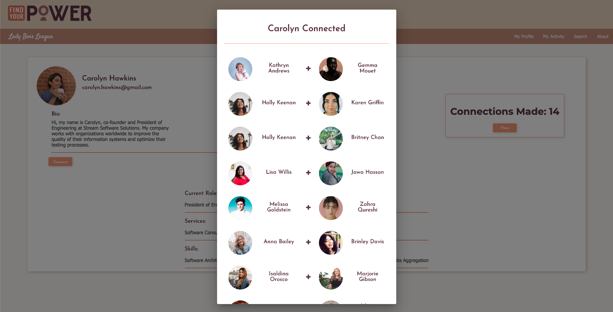

# Find Your Power: A Social Network for Professional Women
This project was created to bring a vision into reality: `Find Your Power`, a local non-profit, wanted to create a community where women can network with each other. As connections are made, women help each other by sharing their skills and resources. The goal is that these partnerships will empower women to be successful and thrive in their businesses. This web application is an interactive social network where women can connect with each other. Users can build a profile which reflects their skills, services, and description of themselves as a professional and they can also facilitate connections by introducing users to each other. 









## Prerequisites
In order to run this project, the following software needed to be installed:
- [Node.js](https://nodejs.org/en/)
- [PostrgeSQL](https://www.postgresql.org/)
- [Nodemon](https://nodemon.io/)

After these are installed, make sure to run `npm install` in the terminal.

## Create a .env file
This project comes with a .env-dist file which needs to be edited. Delete -dist so that the file name becomes .env and make sure that the .env file is within a .gitignore file (this step is very important so that sensitive information like passwords will not be made public). There are four variables within the .env file that needed to be populated. For detailed instructions regarding those variables see sections "Amazon Web Services (S3) Setup" and "Create email address for password reset" below.

## Create the database and tables in SQL
We created a new database called `find_your_power` and created `user` and `connections` tables:

```SQL
CREATE TABLE "user" (
    "id" SERIAL PRIMARY KEY,
    "first_name" VARCHAR (50) NOT NULL,
    "last_name" VARCHAR (80) NOT NULL,
    "password" VARCHAR (1000) NOT NULL,
    "username" VARCHAR (150) UNIQUE NOT NULL,
    "time_user" TIMESTAMP DEFAULT CURRENT_TIMESTAMP,
    "zipcode" INT,
    "bio" VARCHAR (1000),
    "skills" TEXT,
    "services" TEXT,
    "roles" TEXT,
    "avatar" VARCHAR (1000) DEFAULT 'https://ramcotubular.com/wp-content/uploads/default-avatar.jpg',
    "token" VARCHAR (1000),
    "token_exp" TIMESTAMP,
    "venmo" TEXT
);

CREATE TABLE "connections" (
	"id" SERIAL PRIMARY KEY,
	"connecting_id" INT REFERENCES "user",
	"connecting_to_id" INT REFERENCES "user",	
	"connector_id" INT REFERENCES "user",
	"message" TEXT,
	"connecting_accepted" BOOLEAN DEFAULT 'false',
	"connecting_to_accepted" BOOLEAN DEFAULT 'false',
    "active" BOOLEAN DEFAULT 'true'
);
```

## Amazon Web Services (S3) Setup
Amazon Web Services (AWS) S3 is used in this appliction to store the users' profile pictures. Please follow the instructions below to get this setup:
1) Login into AWS with the Find Your Power login credentials at console.aws.amazon.com
2) Once you are logged in, locate "Find Your Power" in the upper right corner of the page and click it to reveal a dropdown.
3) Select "My Security Credentials" in the dropdown.
4) This will take you to a page with a row of several expandable options.
5) Select "Access Keys" option and the row will expand to reveal the access key ID.
6) Click the blue "Create new access key" button. This will open a window which shows your new access key id and new secret access key. Carefully paste these two values into the corresponding variables `AWS_ACCESS_KEY_ID` and `AWS_SECRET_ACCESS_KEY` in the .env file. 

## Create email address for password reset
When users forget their password, they have the option to reset their password by going to the "Forgot Password" page. The user can click the `Send Password Reset Link` button to have a link sent to their email. This email is automatically generated by a no-reply gmail account. Please follow the instructions below to get this setup:
- Create a new gmail account. For example, it could be findyourpowerhelp@gmail.com. 
- Disable the two-step verification for the email account. To do this, go to myaccount.google.com, log in with the new account info, and click the “Security” tab on the left. In the Security view, scroll down to “Signing in to Google” and make sure the “2-Step Verification” is set to “off”
- In the .env file, enter the email address and email password into `EMAIL_ADDRESS` and `EMAIL_PASSWORD`, respectively.

Password reset links will expire after 24 hours. If that amount of time passes without the link be used, the user will have to generate a new one. Once a user successfully resets their password, the link will expire.


## Built With
- React.js
- Redux
- Express
- PostgreSQL
- Passport
- AWS S3
- Material UI
- Nodemailer
- HTML
- CSS    

## Authors
- Brooks Geenen, Hayley Hollermann, Grant Krieger, Victoria Ukatu

## License
----- -----

## Acknowledgments
- We would like to thank Ivy Kaminsky for sharing her vision with us and the opportunity to contribute to the goal of `Find Your Power` through designing and building this application. We would also like to thank Prime Digital Academy and the support we received from our instructors and cohort.


